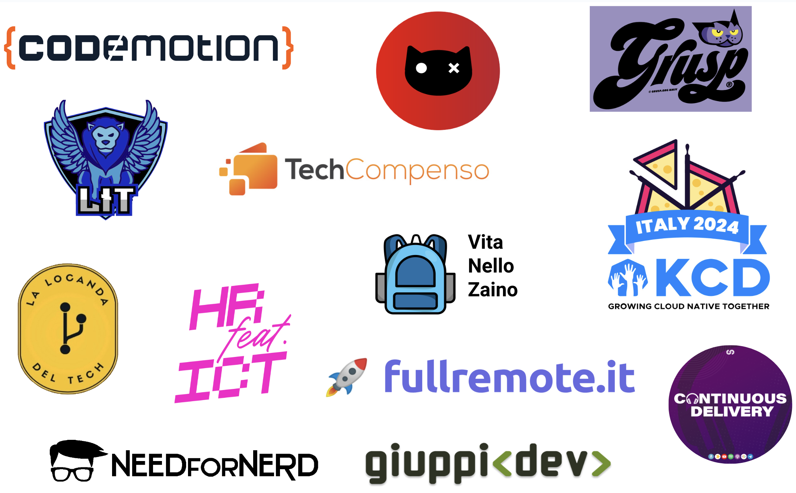

# 🚀 The State of Italian Open-source 2024

**Italia Open-Source** è una comunità fondata sulla filosofia open-source, dove tutte le informazioni e i contenuti sono pubblici e aperti a utilizzo, modifica e integrazione da parte di tutti. Il nostro obiettivo è valorizzare l'intero panorama tecnologico italiano, dando visibilità ai progetti open-source, alle comunità e a tutto ciò che ruota attorno al settore tech.

[<kbd>   Scarica il Report   </kbd>](https://raw.githubusercontent.com/italia-opensource/state-of-italian-opensource-reports/main/reports/2024/the_state_of_italian_open_source_2024.pdf)

### Obiettivo

Lo scopo principale del report è presentare un’istantanea dello status del movimento open-source in Italia cercando di creare un dibattito sui dati raccolti e sulle considerazioni dei pro e contro e delle opportunità derivanti dall'utilizzo in ambito business. Per farlo, abbiamo analizzato:

- Livello di popolarità fra le aziende, ossia come queste usufruiscono e supportano il movimento open-source;
- Livello di popolarità nella community tech italiana, cercando di comprendere le sfide e i metodi più comuni per contribuire alla diffusione del movimento.

### 📌 Contenuti

🟢 **Report**

> I dati del report sono stati raccolti attraverso una survey dal 29/11/23 al 29/02/24.
>
> Una volta chiusa la raccolta dati abbiamo noramlizzato e anonimizzato i dati per poi strutturare un report su di essi.

[<kbd>   Scarica il Report   </kbd>](https://raw.githubusercontent.com/italia-opensource/state-of-italian-opensource-reports/main/reports/2024/the_state_of_italian_open_source_2024.pdf)

[<kbd>   Scarica il Report (Audio)   </kbd>](https://raw.githubusercontent.com/italia-opensource/state-of-italian-opensource-reports/main/reports/2024/the_state_of_italian_open_source_2024.mp3)

[<kbd>   Dati Report   </kbd>](https://github.com/italia-opensource/state-of-italian-opensource-reports/blob/main/reports/2024/report.csv)

🟢 **Open-Source Projects**

> I dati sono raccolti dalla lista dei progetti open-source: [awesome-italia-opensource](https://github.com/italia-opensource/awesome-italia-opensource/tree/main/awesome/opensource)

[<kbd>   Dati Progetti   </kbd>](https://github.com/italia-opensource/state-of-italian-opensource-reports/blob/main/reports/2024/projects.csv)

[<kbd>   Dati Linguaggi   </kbd>](https://github.com/italia-opensource/state-of-italian-opensource-reports/blob/main/reports/2024/languages.csv)

### ❤️ Supportaci

### Social

### Community Partners

**[Become Our Community Partner](https://italiaopensource.com/contributors/sponsor#become-our-community-partner)**

